<div align="center">

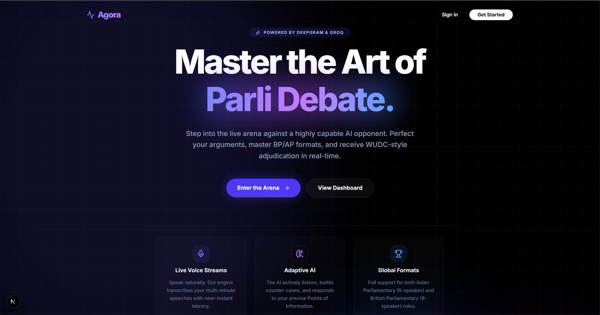

# Agora Frontend

### *The Real-Time Debate Arena*

**A streaming, voice-first, AI-opponent debate experience built on Next.js 16, React 19, and the Web Audio API.**

[](https://nextjs.org/)
[](https://react.dev/)
[](https://www.typescriptlang.org/)
[](https://tailwindcss.com/)
[](https://zustand-demo.pmnd.rs/)
[](https://www.framer.com/motion/)
[](https://supabase.com/)
[]()

[Live Demo](#) · [Architecture](#-architecture) · [User Flow](#-user-journey) · [API Contract](#-websocket-protocol) · [Build Guide](#-getting-started)

</div>

---

## 📖 Table of Contents

- [What is Agora?](#-what-is-agora)
- [Feature Highlights](#-feature-highlights)
- [Visual Tour](#-visual-tour)
- [Architecture](#-architecture)
- [User Journey](#-user-journey)
- [Routes & Pages](#-routes--pages)
- [Tech Stack](#-tech-stack)
- [Project Structure](#-project-structure)
- [State Management Deep Dive](#-state-management-deep-dive)
- [Real-Time Audio Pipeline](#-real-time-audio-pipeline)
- [WebSocket Protocol](#-websocket-protocol)
- [Authentication](#-authentication)
- [Getting Started](#-getting-started)
- [Environment Variables](#-environment-variables)
- [Development](#-development)
- [Deployment](#-deployment)
- [Browser Compatibility](#-browser-compatibility)
- [Troubleshooting](#-troubleshooting)
- [Contributing](#-contributing)

---

## 🏛️ What is Agora?

**Agora** is the visual interface, real-time client-state manager, and media-capture bridge of the **Agora competitive debate platform** — a polyglot, microservice system where you debate live, by voice, against an AI opponent that speaks back to you and is graded against **WUDC (World Universities Debating Championship)** standards.

This repository renders the Arena. It captures your microphone, streams 250 ms PCM chunks to the gateway, decodes binary AI voice payloads through `AudioContext`, and renders streaming AI tokens as a typewriter effect — all while staying connected to a long-lived WebSocket through navigation, refresh, and audio queue churn.

> **Where this repo sits**
> ```
> [ THIS REPO ─ Next.js Frontend ]  ⇄  Go Gateway  ⇄  Python AI Engine
>            (UI · Voice I/O · State)  (STT · TTS · Events)  (4-Phase RAG · Adjudication)
> ```

It pairs with two sibling services:

| Repo | Role | Stack |
|------|------|-------|
| `agora-gateway` | High-throughput WebSocket broker · STT/TTS · reverse proxy | Go · Gorilla · Redis Pub/Sub · Deepgram |
| `agora-ai-engine` | 4-phase debater · 5-phase WUDC adjudicator · RAG | Python · FastAPI · LangChain · pgvector · Groq |

---

## ✨ Feature Highlights

### 🎤 Live Voice Streams
Native **MediaRecorder** captures `audio/webm` at **250 ms slices**, blasted directly through the WebSocket to Deepgram via the gateway — sub-second human transcription with confidence scores.

### 🤖 Adaptive AI Opponents
The opponent's skill is configurable (Beginner · Intermediate · Advanced). The AI adjusts retrieval depth, argument-drop probability, and persona temperature on the fly.

### 🌍 Global Formats
Both **Asian Parliamentary (6 speakers)** and **British Parliamentary (8 speakers)** formats are first-class citizens — role enums, speaker schedules, and team labels are enforced end-to-end.

### 🎵 Web Audio Queue Engine
Multiple AI voice chunks arrive **concurrently** but play **sequentially**. Custom Zustand action `processAudioQueue()` decodes via `AudioContext.decodeAudioData()` and chains `BufferSource.onended` recursively — zero clipping, zero gaps.

### ⌨️ Streaming Typewriter UI
Each AI token (`{event: "AI_TOKEN", text: "word"}`) is appended to a Zustand buffer the instant it lands. Framer Motion's spring layout shifts the DOM fluidly — no jank, no scroll-snap.

### 🪐 Persistent State Across Navigation
WebSocket and audio queue live **outside** the React lifecycle in Zustand + module-scope singletons. Navigating away does not sever a live debate.

### 🛡️ Edge-Verified Sessions
`middleware.ts` runs on the Vercel Edge — Supabase JWTs are validated **before** any client bundle is shipped to unauthorized eyes.

### 🧮 5-Phase WUDC Adjudication UI
The post-match screen renders **Clash Extraction → Weighted Clash Matrix → WUDC Pillar Breakdown → Speaker Scores → Verdict** with progressive polling and animated number counters.

---

## 🎨 Visual Tour

<table>
  <tr>
    <td width="50%" align="center"><b>Landing</b><br/></td>
    <td width="50%" align="center"><b>Sign-in</b><br/>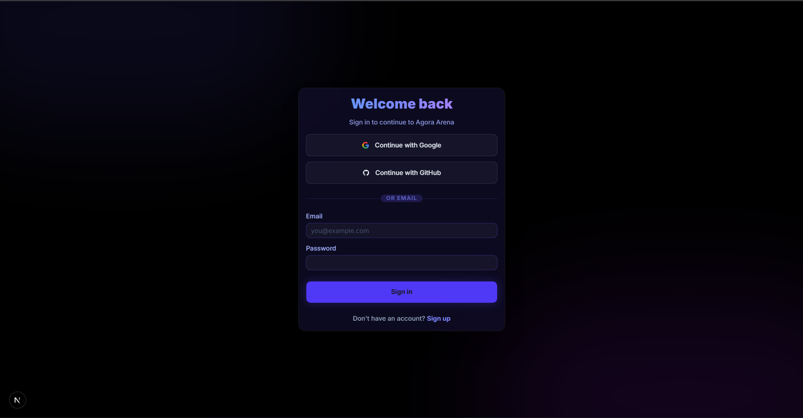</td>
  </tr>
  <tr>
    <td width="50%" align="center"><b>Dashboard</b><br/>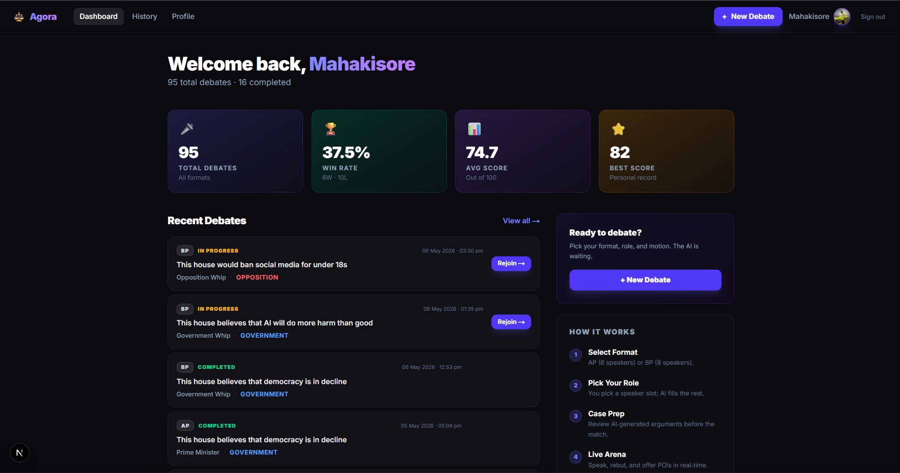</td>
    <td width="50%" align="center"><b>Setup Debate</b><br/>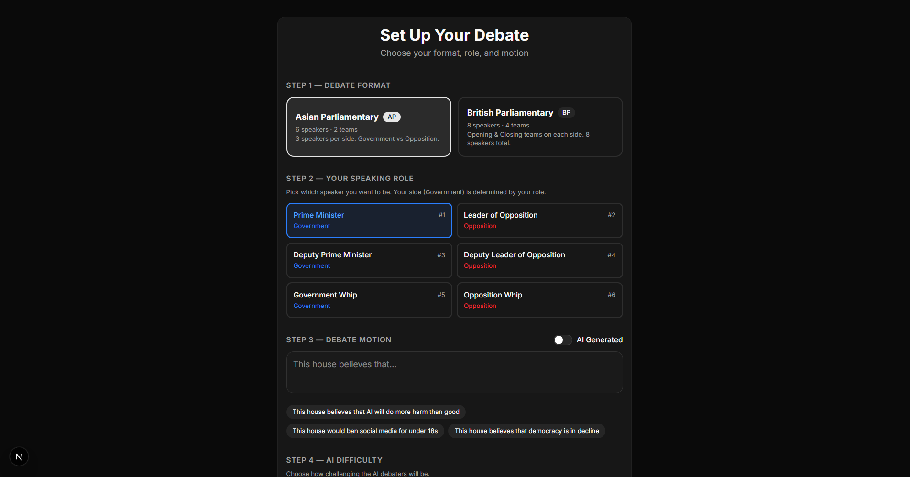</td>
  </tr>
  <tr>
    <td width="50%" align="center"><b>Case Prep</b><br/>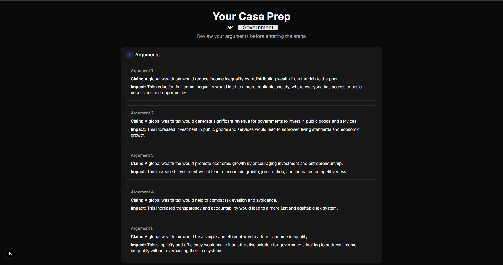</td>
    <td width="50%" align="center"><b>Live Arena (Idle)</b><br/>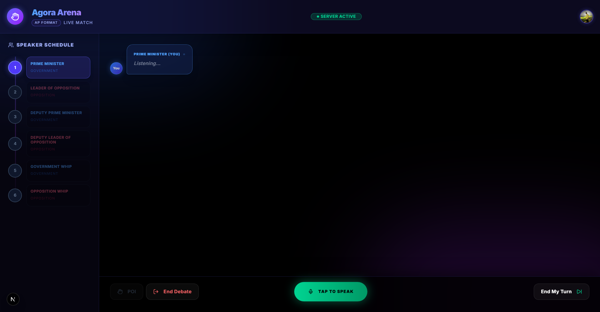</td>
  </tr>
  <tr>
    <td width="50%" align="center"><b>Live Arena (AI Speaking)</b><br/>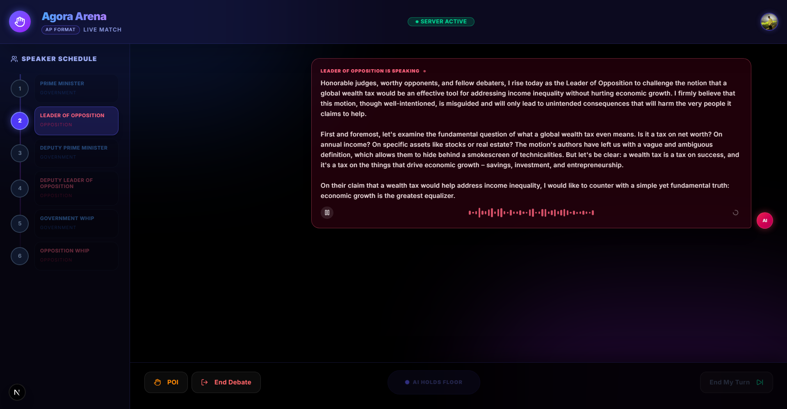</td>
    <td width="50%" align="center"><b>Live Arena (Streaming)</b><br/>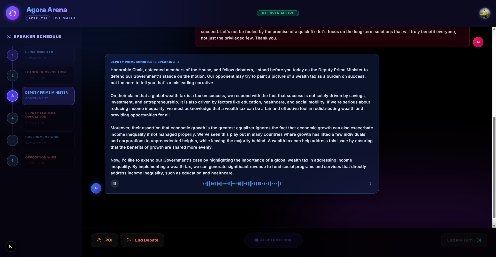</td>
  </tr>
  <tr>
    <td width="50%" align="center"><b>Adjudication</b><br/>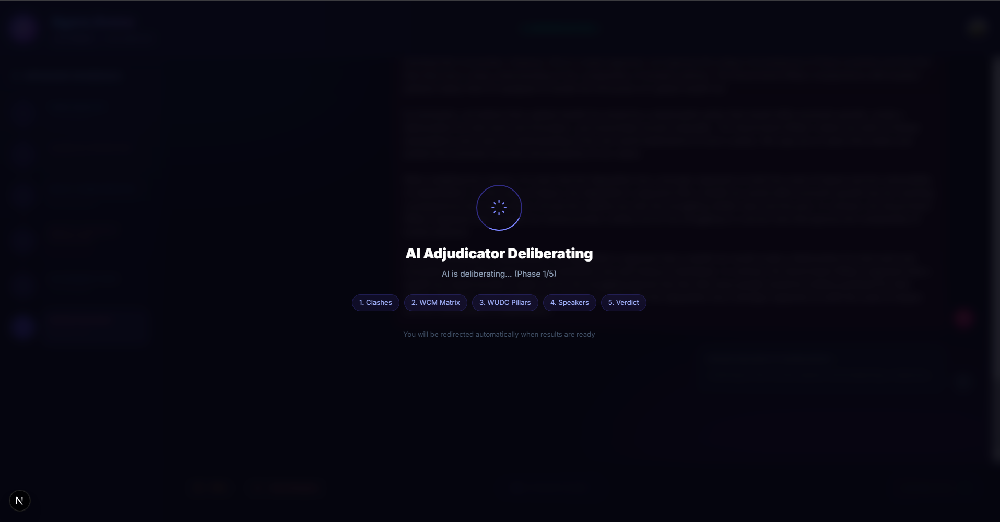</td>
    <td width="50%" align="center"><b>Results — Verdict</b><br/>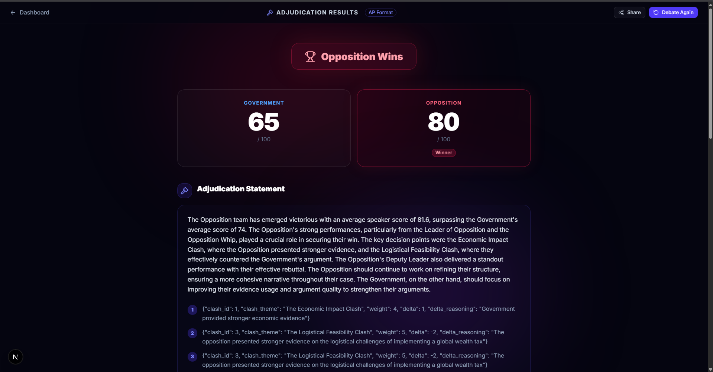</td>
  </tr>
  <tr>
    <td width="50%" align="center"><b>Results — WCM & Pillars</b><br/>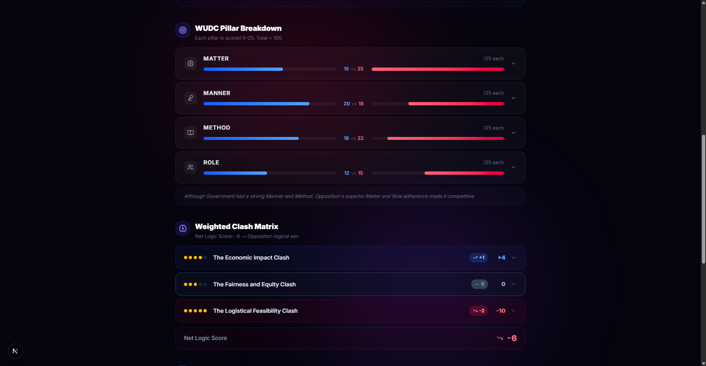</td>
    <td width="50%" align="center"><b>Results — Speakers</b><br/>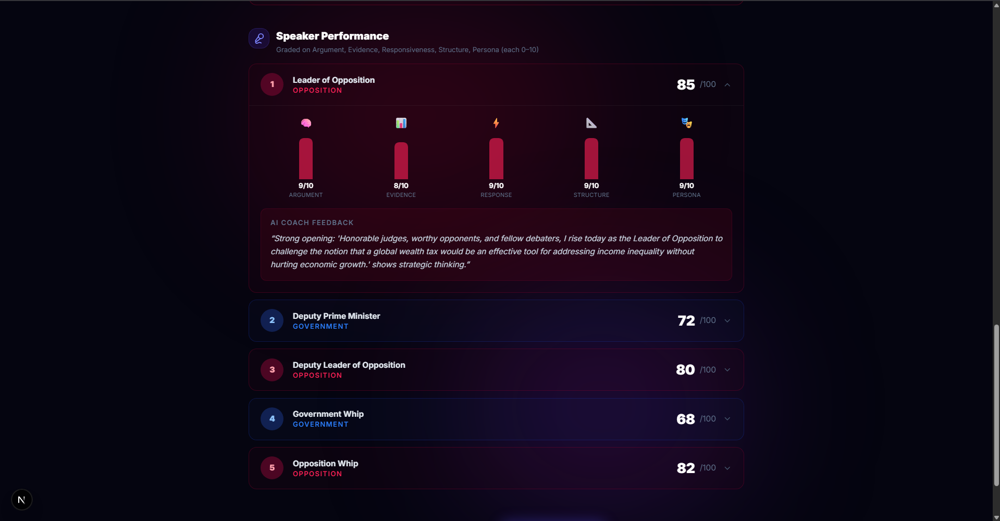</td>
  </tr>
  <tr>
    <td width="50%" align="center"><b>History</b><br/>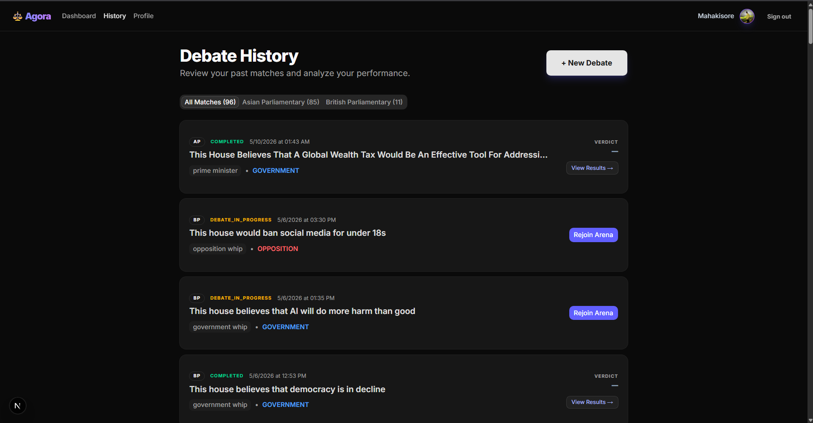</td>
    <td width="50%" align="center"><b>Profile</b><br/>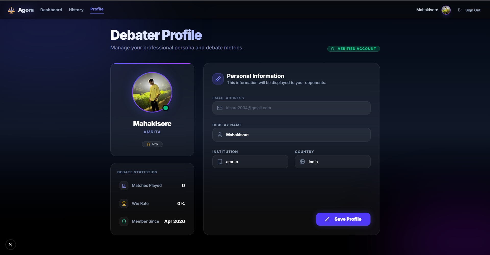</td>
  </tr>
</table>

---

## 🏗️ Architecture

### System Topology

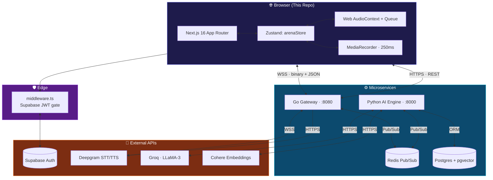

### The Thick-Client Pattern

This frontend is a **decoupled-socket, thick-client** application. Its non-negotiable design rules:

1. **Zustand owns the socket.** WebSockets, audio queues, and decoded `AudioBufferSourceNode` instances live in a Zustand store and module-level singletons — outside React's reconciliation. A re-render never severs a live debate.
2. **Server components for read paths.** Dashboard, History, and Results data are fetched server-side to avoid waterfalls and shave first-paint time.
3. **Client components for the Arena.** `app/debate/[matchId]/page.tsx` is `"use client"` because it depends on `navigator.mediaDevices`, `MediaRecorder`, and `window.AudioContext`.
4. **Edge-first auth.** `middleware.ts` runs on Vercel Edge and rejects unauthorized requests **before** Next.js ships any JS bundle.
5. **Spring-driven layout.** Framer Motion replaces raw CSS height transitions so streaming text animates without snapping.

---

## 🧭 User Journey

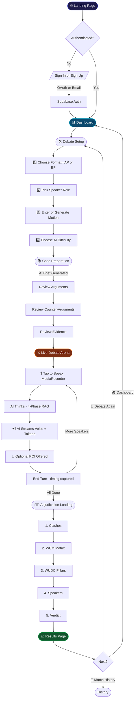

---

## 🗺️ Routes & Pages

| Route | Type | Auth | Purpose |
|-------|------|------|---------|
| `/` | Client | Public | Landing — hero, features, CTAs |
| `/auth/login` | Client | Public | Email + Google + GitHub OAuth |
| `/auth/signup` | Client | Public | Account creation with email confirmation |
| `/auth/callback` | Route Handler | — | OAuth code → session exchange |
| `/dashboard` | Server | 🔒 | Stats, recent matches, format breakdown |
| `/debate/setup` | Client | 🔒 | 4-step debate configuration form |
| `/debate/[matchId]/prep` | Client | 🔒 | AI-generated case-prep brief |
| `/debate/[matchId]` | Client | 🔒 | **Live Arena** — voice + streaming UI |
| `/results/[matchId]` | Client | 🔒 | Adjudication, WCM, pillars, speakers |
| `/history` | Server | 🔒 | All debates with AP/BP filters |
| `/profile` | Client | 🔒 | User profile + avatar upload |

---

## 🧰 Tech Stack

### Framework Layer

| Tech | Version | Why |
|------|---------|-----|
| **Next.js** | 16.2.3 | App Router, Server Components, Edge Middleware, streaming SSR |
| **React** | 19.2.4 | Concurrent rendering for streamed token UI |
| **TypeScript** | 5 | Strict types from socket events through API responses |

### State & Data

| Tech | Why |
|------|-----|
| **Zustand 5** | Subscribes outside React reconciliation — sub-frame socket updates without re-renders |
| **@supabase/ssr** | Cookie-safe SSR auth client (NOT `supabase-js` directly) |
| **@supabase/supabase-js 2.103** | Browser client for OAuth and storage |

### UI

| Tech | Why |
|------|-----|
| **Tailwind CSS 4** | Utility-first; supports glassmorphism via `backdrop-blur-3xl` + `bg-white/[0.03]` |
| **shadcn/ui** | Radix-based, copy-pasted accessible primitives |
| **Framer Motion 12** | Spring-modeled layout shifts for streaming AI text |
| **Lucide React** | Stroke-customizable iconography |
| **Sonner** | Toast notifications |
| **next-themes** | Dark-mode default |
| **class-variance-authority** + **tailwind-merge** | Variant-driven component classes |

### Browser APIs

| API | Purpose |
|-----|---------|
| **MediaRecorder** | 250 ms `audio/webm` chunks streamed binary over the WSS |
| **Web AudioContext** | `decodeAudioData()` + `BufferSource` chained playback queue |
| **WebSocket** | Bidirectional binary + JSON channel to gateway |

---

## 📁 Project Structure

```
agora-frontend/
├── assets/                          # README screenshots
├── public/                          # Static assets (svg icons)
├── middleware.ts                    # Edge auth gate (Supabase SSR)
├── next.config.ts                   # Next.js config
├── components.json                  # shadcn/ui config
│
├── src/
│   ├── app/                         # Next.js App Router
│   │   ├── layout.tsx               # Root layout · AuthProvider · Toaster
│   │   ├── page.tsx                 # Landing
│   │   ├── auth/
│   │   │   ├── login/page.tsx       # Email + OAuth login
│   │   │   ├── signup/page.tsx      # Account creation
│   │   │   └── callback/route.ts    # OAuth exchange
│   │   ├── dashboard/page.tsx       # Server component · stats + matches
│   │   ├── debate/
│   │   │   ├── setup/page.tsx       # 4-step config form
│   │   │   └── [matchId]/
│   │   │       ├── page.tsx         # ⚔️ Live Arena (client)
│   │   │       └── prep/page.tsx    # Case-prep review
│   │   ├── results/[matchId]/page.tsx
│   │   ├── history/page.tsx
│   │   └── profile/page.tsx
│   │
│   ├── store/
│   │   └── arenaStore.ts            # 🧠 The brain · WS + audio queue
│   │
│   ├── lib/
│   │   ├── api.ts                   # REST client + role enums
│   │   ├── supabase/
│   │   │   ├── client.ts            # createBrowserClient
│   │   │   └── server.ts            # createServerClient (cookies)
│   │   └── utils.ts                 # cn() etc.
│   │
│   ├── components/
│   │   ├── providers/
│   │   │   └── AuthProvider.tsx     # Session context + onAuthStateChange
│   │   └── ui/                      # shadcn/ui primitives
│   │
│   ├── hooks/                       # Custom hooks (useArena etc.)
│   └── types/                       # Global TS types
│
├── package.json
├── tsconfig.json
├── eslint.config.mjs
└── postcss.config.mjs
```

---

## 🧠 State Management Deep Dive

The entire live-debate experience is governed by **`src/store/arenaStore.ts`** — a single Zustand store augmented with module-level singletons for non-serializable Web Audio objects.

### State Shape

```typescript
interface ArenaState {
  // Connection
  socket: WebSocket | null;
  connected: boolean;
  matchId: string | null;

  // Speaker tracking
  currentSpeaker: "ai" | "human" | null;
  currentSpeakerRole: string | null;

  // Streaming buffers
  aiBufferedText: string;             // tokens accumulating live
  humanBufferedText: string;          // STT chunks accumulating live
  aiThoughtComplete: boolean;
  transcript: TranscriptEntry[];      // committed history

  // Audio queue
  audioQueue: ArrayBuffer[];          // decoded chunks waiting to play
  isPlayingAudio: boolean;
  isAudioPaused: boolean;
  audioProgress: number;              // 0..1 progress through current chunk
  audioChunkDuration: number;
  pendingAudioBlobs: number;          // FileReader-in-flight count

  // Match lifecycle
  isMatchComplete: boolean;
  verdict: ArenaEvent | null;
  adjudicationComplete: boolean;
  adjudicationMessage: string | null;

  // Timing (forwarded to gateway in END_TURN)
  aiSpeechStartTime: number | null;
  humanTurnStartTime: number | null;
}
```

### Why Audio Lives Outside Zustand

`AudioContext`, `AudioBufferSourceNode`, and the in-flight active source are **mutable, non-serializable singletons** — they don't survive being reduced into immutable state. We hoist them to module scope:

```typescript
let _audioCtx: AudioContext | null = null;
let _activeSource: AudioBufferSourceNode | null = null;
let _activeSourceStartTime: number = 0;
let _activeBufferDuration: number = 0;
let _totalTurnAudioDuration: number = 0;
let _totalTurnAudioPlayed: number = 0;
```

This guarantees clean teardown on `disconnect()` and accurate `getAudioProgress()` reporting.

### Sequential Playback Engine

```typescript
processAudioQueue: () => {
  // Skip if busy, empty, or disconnected
  if (state.isPlayingAudio || state.audioQueue.length === 0) return;
  set({ isPlayingAudio: true });

  audioCtx.decodeAudioData(buffer, (decoded) => {
    const source = audioCtx.createBufferSource();
    source.buffer = decoded;
    source.connect(audioCtx.destination);

    source.onended = () => {
      // Pop, recurse, chain the next chunk
      _totalTurnAudioPlayed += decoded.duration;
      set((s) => ({ audioQueue: s.audioQueue.slice(1), isPlayingAudio: false }));
      get().processAudioQueue();
    };

    source.start();
  });
}
```

This **recursive `onended` chain** is how arbitrarily many TTS sentence chunks play back-to-back without clipping or audible gaps.

### Auto End-Turn

Whenever an AI turn finishes, `checkAiTurnComplete()` fires:

```
if (currentSpeaker === "ai"
    && aiThoughtComplete
    && pendingAudioBlobs === 0
    && audioQueue.length === 0
    && !isPlayingAudio)
{
  socket.send(JSON.stringify({
    action: "END_TURN",
    ai_speech_start_time_utc: ...,
    ai_speech_end_time_utc: ...,
    ai_speech_duration_ms: ...,
  }));
}
```

The frontend is the **single source of truth** for AI speech timing — it knows the exact `audio.onplay()` / `audio.onended()` moments. The gateway and Python engine simply persist what the frontend reports.

---

## 🎙️ Real-Time Audio Pipeline

### Ingress — Human Speaking

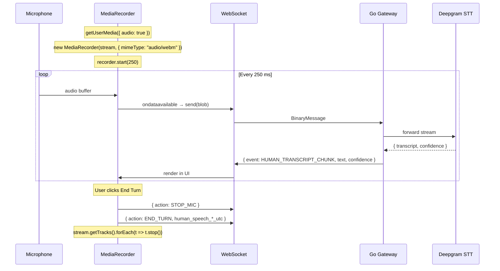

### Egress — AI Speaking

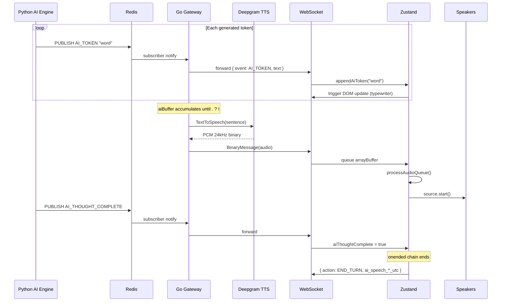

---

## 📡 WebSocket Protocol

### Connection URL
```
wss://{NEXT_PUBLIC_WS_BASE_URL}/ws/live?match_id={matchId}&token={JWT}
```

### Client → Server

| Direction | Event | Payload |
|-----------|-------|---------|
| 📤 JSON | `START_MATCH` | `{ "action": "START_MATCH" }` |
| 📤 JSON | `STOP_MIC` | `{ "action": "STOP_MIC" }` |
| 📤 JSON | `END_TURN` | `{ "action": "END_TURN", "human_speech_start_time_utc": …, "human_speech_end_time_utc": …, "human_speech_duration_ms": … }` |
| 📤 JSON | `POI_OFFERED` | `{ "action": "POI_OFFERED", "text": "…" }` |
| 📤 Binary | Audio chunk | `Blob` (250 ms `audio/webm`) |

### Server → Client

| Direction | Event | Payload |
|-----------|-------|---------|
| 📥 JSON | `TURN_STARTED` | `{ event, speaker: "ai"\|"human", role, side, turn_index }` |
| 📥 JSON | `AI_TOKEN` | `{ event, text }` |
| 📥 JSON | `AI_THOUGHT_COMPLETE` | `{ event }` |
| 📥 JSON | `HUMAN_TRANSCRIPT_CHUNK` | `{ event, text, confidence }` |
| 📥 JSON | `HUMAN_TRANSCRIPT` | `{ event, text }` |
| 📥 JSON | `POI_ACCEPTED` / `POI_DECLINED` | `{ event }` |
| 📥 JSON | `MATCH_COMPLETE` | `{ event, match_id, message }` |
| 📥 JSON | `ADJUDICATION_STARTED` | `{ event }` |
| 📥 JSON | `ADJUDICATION_COMPLETE` | `{ event, verdict, gov_total_score, opp_total_score, ... }` |
| 📥 JSON | `ADJUDICATION_ERROR` / `AI_ERROR` | `{ event, error_message }` |
| 📥 Binary | TTS audio | PCM 24 kHz `linear16` |

---

## 🔐 Authentication

### Edge Middleware

`middleware.ts` runs on **every** request matching the protected matcher. It uses `@supabase/ssr` (not `supabase-js`) so cookies are read from the request and re-issued safely in the response.

```ts
// Protected
[ "/dashboard", "/debate/*", "/results/*", "/history", "/profile" ]

// Reverse-protected (redirect signed-in users away)
[ "/auth/login", "/auth/signup" ]
```

### Auth Providers
- **Email + Password** (Supabase native)
- **Google OAuth**
- **GitHub OAuth**

### Token Flow

```
Browser ─┬─► Supabase Auth ─► JWT
         │
         ├─► localStorage (auth-helpers cookie via @supabase/ssr)
         │
         ├─► REST: Authorization: Bearer ${JWT}
         │
         └─► WS: ?token=${JWT} query param
```

---

## 🚀 Getting Started

### Prerequisites

- **Node.js** ≥ 18 (LTS recommended)
- **npm** (or yarn/pnpm)
- A running **Go Gateway** at `localhost:8080`
- A running **Python AI Engine** at `localhost:8000`
- A **Supabase** project (URL + anon key)

### Install

```bash
git clone <repo-url>
cd agora-frontend

npm install
```

### Configure

```bash
cp .env.example .env.local
# Edit .env.local — see Environment Variables below
```

### Run

```bash
npm run dev
# ► http://localhost:3000
```

---

## 🔑 Environment Variables

Create `.env.local` from `.env.example`:

```env
# Supabase
NEXT_PUBLIC_SUPABASE_URL=https://your-project.supabase.co
NEXT_PUBLIC_SUPABASE_ANON_KEY=eyJhbGciOi...

# Backend
NEXT_PUBLIC_API_BASE_URL=http://localhost:8080
NEXT_PUBLIC_WS_BASE_URL=ws://localhost:8080

# Public site URL (used for OAuth redirect)
NEXT_PUBLIC_SITE_URL=http://localhost:3000
```

> ⚠️ All `NEXT_PUBLIC_*` variables are exposed to the browser. **Do not** put service-role keys here.

---

## 🛠️ Development

### Scripts

| Command | What it does |
|---------|---|
| `npm run dev` | Start Next.js dev server with HMR (`http://localhost:3000`) |
| `npm run build` | Production build (type check + bundle) |
| `npm start` | Run the production server |
| `npm run lint` | ESLint via `eslint-config-next` |

### Code Conventions

- **Server vs. Client** — default to server components; switch to `"use client"` only for browser APIs and event handlers.
- **Strict typing** — every WebSocket event passes through `ArenaEvent` discriminated union in `arenaStore.ts`.
- **Tailwind classes** — composed via `cn()` from `lib/utils.ts` (`clsx` + `tailwind-merge`).
- **Animations** — prefer Framer Motion `<motion.*>` over CSS transitions for streaming layout shifts.

### Adding a New WebSocket Event

1. Extend the `EventType` union in `src/store/arenaStore.ts`.
2. Add the field to `ArenaEvent`.
3. Add a `case` in the `socket.onmessage` handler.
4. Wire any UI consumer via `useArenaStore(state => state.<field>)`.

---

## 🚢 Deployment

### Vercel (Recommended)

1. Push the repo to GitHub.
2. Import into Vercel.
3. Set environment variables in **Project Settings → Environment Variables** (use `NEXT_PUBLIC_*` for those above).
4. Add a custom domain — required for `MediaRecorder` to work without HTTPS warnings on iOS.
5. Vercel auto-detects Next.js and deploys `middleware.ts` to the Edge Network.

### Self-Hosted

```bash
npm run build
npm start  # listens on $PORT (default 3000)
```

Behind Nginx / Cloudflare, ensure WebSocket upgrade headers are forwarded:

```nginx
proxy_set_header Upgrade    $http_upgrade;
proxy_set_header Connection "upgrade";
```

---

## 🌐 Browser Compatibility

| Feature | Chrome | Firefox | Safari | Edge |
|--------|:------:|:-------:|:------:|:----:|
| MediaRecorder (`audio/webm`) | ✅ | ✅ | ⚠️ iOS lacks WebM container — may need MP4 fallback shim | ✅ |
| Web AudioContext | ✅ | ✅ | ⚠️ Requires user gesture before resume | ✅ |
| WebSocket | ✅ | ✅ | ✅ | ✅ |
| Supabase OAuth cookies | ✅ | ✅ | ✅ | ✅ |

> 🍎 **Safari note** — autoplay policies suspend `AudioContext` until a user click. The Arena's Mic button is the trusted gesture that unlocks playback.

---

## 🐛 Troubleshooting

<details>
<summary><b>Microphone permission denied</b></summary>

Browsers block `getUserMedia` over plain HTTP except `localhost`. Run on `localhost:3000` for dev, deploy on HTTPS for production.
</details>

<details>
<summary><b>AI tokens stream but no audio plays</b></summary>

Likely a Safari `AudioContext` suspended state. Click the Mic or any user-gesture button — the next `processAudioQueue()` call will resume the context.
</details>

<details>
<summary><b>"Constantly logged out on localhost"</b></summary>

Supabase cookies are flagged `SameSite=Lax` and `Secure` in some configs. Local HTTP browsers may discard them on hard reload. Push to Vercel (HTTPS) and the issue disappears.
</details>

<details>
<summary><b>WebSocket connects then closes immediately</b></summary>

- Confirm the Go gateway is up at `NEXT_PUBLIC_WS_BASE_URL`.
- Confirm the JWT in the query string is valid (use [jwt.io](https://jwt.io)).
- Open DevTools → Network → WS — read the close code (1006 = no auth, 1011 = backend crash).
</details>

<details>
<summary><b>Audio chunks play out of order or overlap</b></summary>

Should not happen — the recursive `onended` chain serializes playback. If it does, the queue likely got mutated outside Zustand. Check that no component is bypassing `processAudioQueue()`.
</details>

---

## 🤝 Contributing

### Branch Strategy
```
main             # production
develop          # integration
feature/<name>   # features
bugfix/<id>      # bug fixes
```

### Commit Convention
```
feat: add waveform visualizer
fix: resolve audio overlap on rapid POI
docs: update WebSocket protocol table
refactor: extract audio queue into module-scope
```

### PR Checklist
- [ ] `npm run lint` passes
- [ ] `npm run build` succeeds
- [ ] No new `console.log` calls left
- [ ] Screenshots attached for UI changes

---

## 📚 Further Reading

- [agora-frontend-architecture.md](./agora-frontend-architecture.md) — FAANG-grade design analysis
- [`agora-gateway`](../agora-gateway) — sibling Go socket broker
- [`agora-ai-engine`](../agora-ai-engine) — sibling Python AI engine
- [Next.js App Router](https://nextjs.org/docs/app)
- [Zustand patterns](https://zustand-demo.pmnd.rs/)
- [Supabase SSR](https://supabase.com/docs/guides/auth/server-side/nextjs)

---

<div align="center">

**Built with ⚡ by the Agora team**

[Report a bug](https://github.com/) · [Request a feature](https://github.com/) · [Watch the demo](#)

*Crafted for IDL × Agentix · Hackathon 2026*

</div>
