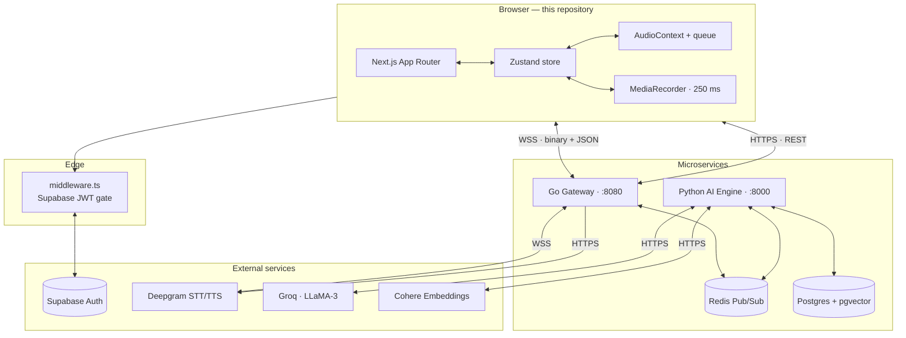
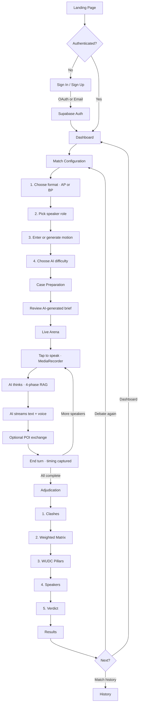
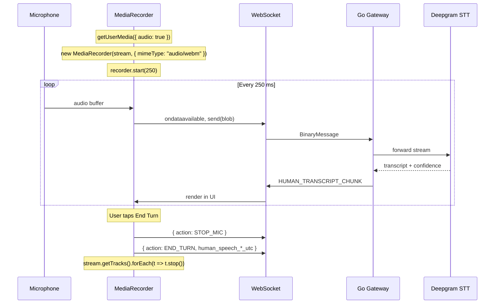
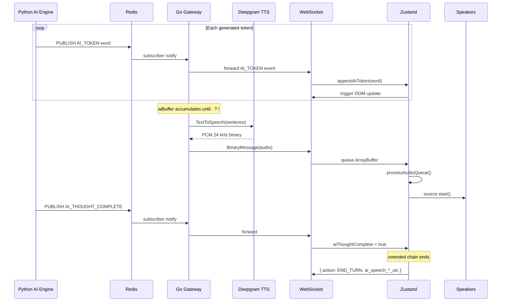

<div align="center">


<br/>

# Agora — Web Client

The real-time debate arena. A voice-first, streaming interface where a human debates a competitive AI opponent under formal parliamentary rules, with WUDC-style adjudication delivered live.

<br/>

[](https://nextjs.org/)
[](https://react.dev/)
[](https://www.typescriptlang.org/)
[](https://tailwindcss.com/)
[](https://supabase.com/)
[]()

<br/>

<a href="https://skillicons.dev">
  
</a>

<br/>
<br/>

[Architecture](#architecture) · [User Flow](#user-flow) · [Engineering Decisions](#engineering-decisions) · [WebSocket Protocol](#websocket-protocol) · [Getting Started](#getting-started)

</div>

---

## Table of Contents

1. [Overview](#overview)
2. [Product Capabilities](#product-capabilities)
3. [Product Tour](#product-tour)
4. [Architecture](#architecture)
5. [User Flow](#user-flow)
6. [Application Routes](#application-routes)
7. [Engineering Decisions](#engineering-decisions)
8. [State Management](#state-management)
9. [Real-Time Audio Pipeline](#real-time-audio-pipeline)
10. [WebSocket Protocol](#websocket-protocol)
11. [Authentication](#authentication)
12. [Project Structure](#project-structure)
13. [Tech Stack](#tech-stack)
14. [Getting Started](#getting-started)
15. [Environment Variables](#environment-variables)
16. [Development](#development)
17. [Deployment](#deployment)
18. [Browser Compatibility](#browser-compatibility)
19. [Troubleshooting](#troubleshooting)
20. [Contributing](#contributing)

---

## Overview

Agora is a competitive parliamentary debate platform. The product allows a user to:

- Compete in **Asian Parliamentary (AP)** or **British Parliamentary (BP)** formats against an AI opponent that respects WUDC role duties.
- Speak naturally into their microphone with sub-second transcription.
- Receive streaming, voice-synthesized responses from the AI in real time.
- Get tournament-grade adjudication after each match — clash extraction, weighted matrix, WUDC pillar scoring, and per-speaker grading with verbatim quotes.

This repository is the **web client**. It owns the visual interface, the real-time client state, and the bridge between browser media APIs and the platform's backend.

### Where this service sits

Agora is composed of three services. This repository is the user-facing one.

| Service | Responsibility | Stack |
|---|---|---|
| **agora-frontend** *(this repo)* | Browser UI, WebSocket lifecycle, microphone capture, audio playback queue | Next.js, React, TypeScript, Zustand |
| **agora-gateway** | WebSocket broker, STT/TTS multiplexer, reverse proxy, Redis state mutator | Go, Gorilla, Redis |
| **agora-ai-engine** | Four-phase debater, five-phase adjudicator, RAG, persistence | Python, FastAPI, LangChain, pgvector |

The client talks exclusively to the gateway. The gateway talks to the AI engine through Redis and a reverse HTTP proxy.

---

## Product Capabilities

**Live voice streams.** Audio is captured at 250 ms slices via `MediaRecorder`, transmitted as binary frames over an authenticated WebSocket, and transcribed by Deepgram with confidence metrics surfaced to the UI.

**Adaptive AI opponents.** The AI's skill level is configurable per match across three independent levers — retrieval depth, memory drop probability, and persona temperature. The client surfaces these as Beginner, Intermediate, and Advanced.

**Two tournament formats.** Asian Parliamentary (six speakers) and British Parliamentary (eight speakers, four teams) are first-class. Role enums, speaker schedules, and team labels are enforced end-to-end.

**Sequential audio playback.** Multiple TTS chunks arrive concurrently but are queued and played serially through the Web Audio API. No clipping, no overlap, no perceptible gaps between sentence chunks.

**Streaming token UI.** Each AI token is appended to the transcript as it arrives. Framer Motion handles layout shifts so the DOM grows fluidly without jank or scroll-snap artifacts.

**Persistent real-time state.** The WebSocket connection and the audio queue live outside the React component lifecycle. Page navigation, component unmounts, and tab focus changes do not sever an active debate.

**Edge-level authentication.** Supabase JWTs are validated by Next.js middleware on the Edge Network before any client bundle is shipped to unauthenticated requesters.

**Full match history and analytics.** Users can review every match, drill into per-speaker breakdowns, and track win rate, average score, and best score across both formats.

---

## Product Tour

<table>
  <tr>
    <td width="50%" align="center"><strong>Landing</strong><br/></td>
    <td width="50%" align="center"><strong>Sign In</strong><br/></td>
  </tr>
  <tr>
    <td width="50%" align="center"><strong>Dashboard</strong><br/></td>
    <td width="50%" align="center"><strong>Match Configuration</strong><br/></td>
  </tr>
  <tr>
    <td width="50%" align="center"><strong>Case Preparation</strong><br/></td>
    <td width="50%" align="center"><strong>Arena — Idle</strong><br/></td>
  </tr>
  <tr>
    <td width="50%" align="center"><strong>Arena — Streaming Speech</strong><br/></td>
    <td width="50%" align="center"><strong>Arena — Active Speaker</strong><br/></td>
  </tr>
  <tr>
    <td width="50%" align="center"><strong>Adjudication In Progress</strong><br/></td>
    <td width="50%" align="center"><strong>Results — Verdict</strong><br/></td>
  </tr>
  <tr>
    <td width="50%" align="center"><strong>Results — Pillars and Matrix</strong><br/></td>
    <td width="50%" align="center"><strong>Results — Speaker Grades</strong><br/></td>
  </tr>
  <tr>
    <td width="50%" align="center"><strong>Match History</strong><br/></td>
    <td width="50%" align="center"><strong>Profile</strong><br/></td>
  </tr>
</table>

---

## Architecture

### System topology



### Client topology in one sentence

A thick React client owns the WebSocket and the Web Audio queue in a Zustand store, server components handle non-real-time data fetching, and Edge middleware gates authentication before any bundle leaves the CDN.

---

## User Flow



---

## Application Routes

| Route | Render | Auth | Purpose |
|---|---|---|---|
| `/` | Client | Public | Landing — product overview, calls to action |
| `/auth/login` | Client | Public | Email, Google, GitHub authentication |
| `/auth/signup` | Client | Public | Account creation with email confirmation |
| `/auth/callback` | Route Handler | — | OAuth code-to-session exchange |
| `/dashboard` | Server | Required | Stats, recent matches, format breakdown |
| `/debate/setup` | Client | Required | Four-step match configuration |
| `/debate/[matchId]/prep` | Client | Required | AI-generated case-prep brief |
| `/debate/[matchId]` | Client | Required | Live Arena — voice and streaming UI |
| `/results/[matchId]` | Client | Required | Adjudication, WCM, pillars, speakers |
| `/history` | Server | Required | All debates with AP/BP filters |
| `/profile` | Client | Required | User profile, avatar upload |

---

## Engineering Decisions

The following are the non-trivial technical decisions made while building this client. Each is framed as a problem encountered and the constraint that drove the solution.

### 1. WebSocket and audio must survive React's lifecycle

**Problem.** React components mount and unmount on navigation, state changes, and Suspense boundaries. A naive implementation that stored the WebSocket in component state would tear down the connection every time the user opened a modal, switched tabs, or triggered a hot-reload. Audio chunks in flight would be lost.

**Solution.** The WebSocket reference and audio queue live in a Zustand store, with the active `AudioBufferSourceNode` and `AudioContext` hoisted to module scope. Zustand subscribes outside React's reconciliation, so updates fire without re-rendering the tree, and the singletons are immune to component unmount cascades.

**Implementation.** `src/store/arenaStore.ts`

```ts
// Module-scope singletons — outlive any component
let _audioCtx: AudioContext | null = null;
let _activeSource: AudioBufferSourceNode | null = null;
let _activeSourceStartTime: number = 0;
let _totalTurnAudioPlayed: number = 0;
```

### 2. Sequential playback for concurrent TTS chunks

**Problem.** The gateway sends TTS audio at sentence boundaries. For a long AI speech, ten or more audio chunks arrive within seconds. Playing them as they arrive produces an audio collision — sentence one and sentence three overlap, producing garbled speech.

**Solution.** Maintain an `ArrayBuffer[]` queue. When a chunk arrives, push and trigger `processAudioQueue()`. The processor decodes a single buffer through `AudioContext.decodeAudioData`, creates a fresh `BufferSource`, sets `onended` to recursively process the next chunk, and only then calls `source.start()`. Playback is strictly serial, gapless, and reorder-safe.

**Implementation.**

```ts
processAudioQueue: () => {
  if (state.isPlayingAudio || state.audioQueue.length === 0) return;
  set({ isPlayingAudio: true });

  audioCtx.decodeAudioData(buffer, (decoded) => {
    const source = audioCtx.createBufferSource();
    source.buffer = decoded;
    source.connect(audioCtx.destination);
    source.onended = () => {
      _totalTurnAudioPlayed += decoded.duration;
      set((s) => ({ audioQueue: s.audioQueue.slice(1), isPlayingAudio: false }));
      get().processAudioQueue();
    };
    source.start();
  });
};
```

### 3. The browser owns speech-timing measurement

**Problem.** AI speech duration is a metric that affects scoring and analytics. The Go gateway forwards audio bytes; the Python engine generates the text. Neither knows precisely when audio actually played in the user's browser, because network latency and TTS round-trip times are non-deterministic.

**Solution.** The browser measures everything. The frontend captures `audio.onplay()` and `audio.onended()` timestamps and includes them in the `END_TURN` event sent to the gateway. The gateway forwards the timing untouched. The AI engine persists exactly what the frontend reported.

**Rationale.** The browser is the only system that knows the moment audio hardware actually produced sound. Measuring anywhere else introduces network and clock-skew error.

### 4. Edge authentication before bundle ship

**Problem.** A naive Next.js app ships its JavaScript bundle first and authenticates inside React after hydration. This means unauthenticated users have already downloaded the protected client code.

**Solution.** `middleware.ts` runs on the Edge Network. Supabase JWT cookies are validated against the auth project before any bundle is served. Unauthenticated requesters to protected routes are redirected to `/auth/login` at the edge.

**Implementation.** `middleware.ts` uses `@supabase/ssr` (not `@supabase/supabase-js`) to handle cookies safely in the Edge runtime.

### 5. Streaming token UI without layout thrash

**Problem.** Streaming a debate speech token-by-token means hundreds of DOM mutations per second. CSS height transitions snap. `auto`-height containers produce flickering scroll. Naive autoscroll fights user scroll position.

**Solution.** Each transcript entry is a Framer Motion component. Layout shifts are interpolated by spring physics (`stiffness: 200`, `damping: 20`) so growth animates smoothly. The transcript scroll container uses controlled programmatic scroll only when the user is already at the bottom — manual scrollback is respected.

### 6. Audio decoupled from non-serializable Zustand state

**Problem.** Zustand expects serializable state. `AudioContext` and `AudioBufferSourceNode` are mutable, non-serializable browser singletons. Reducing them into Zustand state produces stale closures and broken `onended` callbacks.

**Solution.** Audio primitives live at module scope outside Zustand. The store exposes a small typed API (`processAudioQueue`, `stopAllAudio`, `pauseAudio`, `resumeAudio`, `skipAiSpeech`, `getAudioProgress`) that mutates these singletons under controlled conditions. The store still holds the queue itself, which is serializable, for the UI to observe.

### 7. Deterministic auto end-turn

**Problem.** When does an AI turn actually end? When tokens stop arriving? When audio finishes playing? When the engine sends a completion event? Each on its own is racy.

**Solution.** All four conditions must be true simultaneously:

```
currentSpeaker === "ai"
&& aiThoughtComplete === true
&& pendingAudioBlobs === 0
&& audioQueue.length === 0
&& !isPlayingAudio
```

When the predicate holds, the client sends `END_TURN` with measured timing. This is the only place in the codebase that ends an AI turn — eliminating duplicate `END_TURN` emissions and stale-event races.

---

## State Management

The arena is governed by a single Zustand store at [`src/store/arenaStore.ts`](src/store/arenaStore.ts).

### State shape

```ts
interface ArenaState {
  // Connection
  socket: WebSocket | null;
  connected: boolean;
  matchId: string | null;

  // Speaker tracking
  currentSpeaker: "ai" | "human" | null;
  currentSpeakerRole: string | null;

  // Streaming buffers (committed to transcript on TURN_STARTED)
  aiBufferedText: string;
  humanBufferedText: string;
  aiThoughtComplete: boolean;
  transcript: TranscriptEntry[];

  // Audio queue
  audioQueue: ArrayBuffer[];
  isPlayingAudio: boolean;
  isAudioPaused: boolean;
  audioProgress: number;       // 0..1 progress within current chunk
  audioChunkDuration: number;
  pendingAudioBlobs: number;   // FileReader operations in flight

  // Match lifecycle
  isMatchComplete: boolean;
  verdict: ArenaEvent | null;
  adjudicationComplete: boolean;
  adjudicationMessage: string | null;

  // Timing (forwarded to gateway in END_TURN)
  aiSpeechStartTime: number | null;
  humanTurnStartTime: number | null;
}
```

### Event handler map

| Inbound event | Action |
|---|---|
| `AI_TOKEN` | Append text to `aiBufferedText` |
| `HUMAN_TRANSCRIPT_CHUNK` | Append text to `humanBufferedText` |
| `HUMAN_TRANSCRIPT` | Flush `humanBufferedText` to transcript |
| `TURN_STARTED` | Commit both buffers to transcript, set new speaker, reset audio counters |
| `AI_THOUGHT_COMPLETE` | Set `aiThoughtComplete = true`, evaluate `checkAiTurnComplete()` |
| `MATCH_COMPLETE` | Set `isMatchComplete`, capture verdict |
| `ADJUDICATION_STARTED` | Update adjudication message |
| `ADJUDICATION_COMPLETE` | Set `adjudicationComplete`, trigger redirect |
| `Blob` (binary) | FileReader → push `ArrayBuffer` to queue → `processAudioQueue()` |

---

## Real-Time Audio Pipeline

### Ingress — Human Speaking



### Egress — AI Speaking



---

## WebSocket Protocol

### Endpoint

```
wss://{NEXT_PUBLIC_WS_BASE_URL}/ws/live?match_id={matchId}&token={JWT}
```

### Client → Server

| Direction | Event | Payload |
|---|---|---|
| JSON | `START_MATCH` | `{ "action": "START_MATCH" }` |
| JSON | `STOP_MIC` | `{ "action": "STOP_MIC" }` |
| JSON | `END_TURN` | `{ "action": "END_TURN", "human_speech_start_time_utc": ..., "human_speech_end_time_utc": ..., "human_speech_duration_ms": ... }` |
| JSON | `POI_OFFERED` | `{ "action": "POI_OFFERED", "text": "..." }` |
| Binary | Audio chunk | `Blob` (250 ms `audio/webm`) |

### Server → Client

| Direction | Event | Payload |
|---|---|---|
| JSON | `TURN_STARTED` | `{ event, speaker: "ai" \| "human", role, side, turn_index }` |
| JSON | `AI_TOKEN` | `{ event, text }` |
| JSON | `AI_THOUGHT_COMPLETE` | `{ event }` |
| JSON | `HUMAN_TRANSCRIPT_CHUNK` | `{ event, text, confidence }` |
| JSON | `HUMAN_TRANSCRIPT` | `{ event, text }` |
| JSON | `POI_ACCEPTED` / `POI_DECLINED` | `{ event }` |
| JSON | `MATCH_COMPLETE` | `{ event, match_id, message }` |
| JSON | `ADJUDICATION_STARTED` | `{ event }` |
| JSON | `ADJUDICATION_COMPLETE` | `{ event, verdict, gov_total_score, opp_total_score, ... }` |
| JSON | `ADJUDICATION_ERROR` / `AI_ERROR` | `{ event, error_message }` |
| Binary | TTS audio | PCM 24 kHz `linear16` |

---

## Authentication

### Provider

Supabase Auth with three sign-in methods: email and password, Google OAuth, and GitHub OAuth.

### Edge gate

`middleware.ts` runs on every request matching the protected matcher. It uses `@supabase/ssr` (the cookie-safe SSR client) to validate the session.

```
Protected routes:        /dashboard, /debate/*, /results/*, /history, /profile
Reverse-protected:       /auth/login, /auth/signup  (signed-in users are redirected away)
```

### Token flow

```
Browser
   │
   ├── Supabase Auth ── JWT
   │
   ├── Auth cookie via @supabase/ssr
   │
   ├── REST:  Authorization: Bearer {JWT}
   │
   └── WS:    ?token={JWT}
```

---

## Project Structure

```
agora-frontend/
├── assets/                          README screenshots
├── public/                          Static assets
├── middleware.ts                    Edge auth gate (Supabase SSR)
├── next.config.ts
├── components.json                  shadcn/ui config
│
├── src/
│   ├── app/                         Next.js App Router
│   │   ├── layout.tsx               Root layout, AuthProvider, Toaster
│   │   ├── page.tsx                 Landing
│   │   ├── auth/
│   │   │   ├── login/page.tsx
│   │   │   ├── signup/page.tsx
│   │   │   └── callback/route.ts    OAuth exchange
│   │   ├── dashboard/page.tsx       Server component, stats and matches
│   │   ├── debate/
│   │   │   ├── setup/page.tsx       Four-step config form
│   │   │   └── [matchId]/
│   │   │       ├── page.tsx         Live Arena (client)
│   │   │       └── prep/page.tsx    Case-prep review
│   │   ├── results/[matchId]/page.tsx
│   │   ├── history/page.tsx
│   │   └── profile/page.tsx
│   │
│   ├── store/
│   │   └── arenaStore.ts            WebSocket + audio queue state
│   │
│   ├── lib/
│   │   ├── api.ts                   REST client + role enums
│   │   ├── supabase/
│   │   │   ├── client.ts            createBrowserClient
│   │   │   └── server.ts            createServerClient (cookies)
│   │   └── utils.ts                 cn() helpers
│   │
│   ├── components/
│   │   ├── providers/
│   │   │   └── AuthProvider.tsx     Session context, onAuthStateChange
│   │   └── ui/                      shadcn/ui primitives
│   │
│   ├── hooks/                       Custom hooks
│   └── types/                       Shared TypeScript types
│
├── package.json
├── tsconfig.json
├── eslint.config.mjs
└── postcss.config.mjs
```

---

## Tech Stack

### Framework

| Technology | Version | Purpose |
|---|---|---|
| Next.js | 16.2.3 | App Router, Server Components, Edge Middleware |
| React | 19.2.4 | Concurrent rendering |
| TypeScript | 5 | Strict typing through socket events and API responses |

### State and data

| Technology | Purpose |
|---|---|
| Zustand 5 | Out-of-React state for socket and audio |
| @supabase/ssr | Cookie-safe SSR auth client |
| @supabase/supabase-js | Browser client for OAuth and storage |

### User interface

| Technology | Purpose |
|---|---|
| Tailwind CSS 4 | Utility-first styling |
| shadcn/ui | Radix-based, copy-in component primitives |
| Framer Motion 12 | Spring-modeled layout transitions |
| Lucide React | Iconography |
| Sonner | Toast notifications |
| next-themes | Dark-mode handling |

### Browser APIs

| API | Purpose |
|---|---|
| MediaRecorder | 250 ms `audio/webm` chunked microphone capture |
| AudioContext | `decodeAudioData` + `BufferSource` playback chain |
| WebSocket | Bidirectional binary and JSON channel to gateway |

---

## Getting Started

### Prerequisites

- Node.js 18 or later (LTS recommended)
- npm, yarn, or pnpm
- A running Go gateway on `localhost:8080`
- A running Python AI engine on `localhost:8000`
- A Supabase project (URL and anon key)

### Install

```bash
git clone <repository-url>
cd agora-frontend
npm install
```

### Configure

```bash
cp .env.example .env.local
# Edit .env.local with your credentials
```

### Run

```bash
npm run dev
# Open http://localhost:3000
```

---

## Environment Variables

Create `.env.local` from `.env.example`:

```env
# Supabase
NEXT_PUBLIC_SUPABASE_URL=https://your-project.supabase.co
NEXT_PUBLIC_SUPABASE_ANON_KEY=eyJhbGciOi...

# Backend
NEXT_PUBLIC_API_BASE_URL=http://localhost:8080
NEXT_PUBLIC_WS_BASE_URL=ws://localhost:8080

# Public site URL (used for OAuth redirect)
NEXT_PUBLIC_SITE_URL=http://localhost:3000
```

All `NEXT_PUBLIC_*` variables are exposed to the browser. Do not place service-role keys here.

---

## Development

### Available scripts

| Command | Effect |
|---|---|
| `npm run dev` | Start Next.js dev server with HMR |
| `npm run build` | Production build with type-check |
| `npm start` | Run the production server |
| `npm run lint` | ESLint via `eslint-config-next` |

### Code conventions

- Default to server components. Switch to `"use client"` only when browser APIs or event handlers require it.
- All WebSocket events pass through the discriminated union `ArenaEvent` in `arenaStore.ts`.
- Compose Tailwind classes through `cn()` from `lib/utils.ts` (`clsx` + `tailwind-merge`).
- Prefer Framer Motion components over CSS transitions for any layout that animates during streaming.

### Adding a new WebSocket event

1. Extend the `EventType` union in `src/store/arenaStore.ts`.
2. Add the optional field to `ArenaEvent`.
3. Add a case in the `socket.onmessage` handler.
4. Wire the UI consumer via `useArenaStore(state => state.<field>)`.

---

## Deployment

### Vercel

1. Push the repository to GitHub.
2. Import into Vercel.
3. Set environment variables under Project Settings → Environment Variables.
4. Add a custom domain. HTTPS is required for `MediaRecorder` to operate without browser warnings, especially on iOS.

### Self-hosted

```bash
npm run build
npm start
```

Behind Nginx or Cloudflare, ensure WebSocket upgrade headers are forwarded:

```nginx
proxy_set_header Upgrade    $http_upgrade;
proxy_set_header Connection "upgrade";
```

---

## Browser Compatibility

| Capability | Chrome | Firefox | Safari | Edge |
|---|:-:|:-:|:-:|:-:|
| MediaRecorder (`audio/webm`) | Yes | Yes | iOS lacks WebM container; an MP4 shim is required for production | Yes |
| AudioContext | Yes | Yes | Requires a user gesture before resume | Yes |
| WebSocket | Yes | Yes | Yes | Yes |
| Supabase OAuth cookies | Yes | Yes | Yes | Yes |

Safari autoplay policy keeps the `AudioContext` suspended until a user gesture. The Arena's microphone button is the trusted gesture that unlocks playback.

---

## Troubleshooting

<details>
<summary><strong>Microphone permission is denied</strong></summary>

Browsers block `getUserMedia` over plain HTTP except on `localhost`. Develop on `localhost:3000` and deploy on HTTPS.
</details>

<details>
<summary><strong>AI tokens stream but no audio plays</strong></summary>

The `AudioContext` is suspended (Safari autoplay policy). Click the microphone or any user-gesture button — the next `processAudioQueue()` call will resume the context.
</details>

<details>
<summary><strong>Session is dropped on localhost reload</strong></summary>

Supabase cookies are flagged `SameSite=Lax` and `Secure` in some configurations. Local HTTP browsers may discard them on hard reload. Deploy to HTTPS to resolve.
</details>

<details>
<summary><strong>WebSocket connects then closes immediately</strong></summary>

- Confirm the Go gateway is reachable at `NEXT_PUBLIC_WS_BASE_URL`.
- Verify the JWT in the query string is well-formed.
- Open DevTools, Network, WS frame: inspect the close code (1006 indicates no auth, 1011 indicates a backend crash).
</details>

<details>
<summary><strong>Audio chunks play out of order or overlap</strong></summary>

The recursive `onended` chain serializes playback. If overlap occurs, the queue was mutated outside Zustand. Audit any component that touches `audioQueue` directly and confirm it routes through `processAudioQueue()`.
</details>

---

## Contributing

### Branch strategy

```
main             production
develop          integration
feature/<name>   features
bugfix/<id>      bug fixes
```

### Commit convention

```
feat: add waveform visualizer
fix: resolve audio overlap on rapid POI
docs: update WebSocket protocol table
refactor: extract audio queue into module-scope
```

### Pull request checklist

- `npm run lint` passes
- `npm run build` succeeds
- No `console.log` statements remain
- Screenshots attached for UI changes

---

## Further Reading

- [agora-frontend-architecture.md](./agora-frontend-architecture.md) — detailed design analysis
- [`agora-gateway`](../agora-gateway) — sibling Go socket broker
- [`agora-ai-engine`](../agora-ai-engine) — sibling Python AI engine
- [Next.js App Router](https://nextjs.org/docs/app)
- [Zustand patterns](https://zustand-demo.pmnd.rs/)
- [Supabase SSR](https://supabase.com/docs/guides/auth/server-side/nextjs)

---

<div align="center">

**Built with ⚡ by the Agora team**

[Report a bug](https://github.com/) · [Request a feature](https://github.com/) · [Watch the demo](#)


</div>
